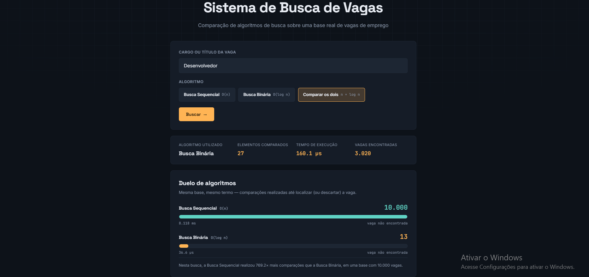

## Informações da Disciplina

**Disciplina:** Estruturas de Dados 2 - 2026.2  
**Professor:** Maurício Serrano  
**Trabalho:** T1 - Algoritmos de Busca

## Alunos

| Matrícula | Nome |
|-----------------------|---------------------|
| 23/1026699 | Eduarda Domingos Rodrigues |
| 23/1012316 | Yasmin Moreira do Nascimento |

---

## Descrição do projeto

Este projeto foi desenvolvido para a disciplina de **Estruturas de Dados 2** com o objetivo de aplicar, analisar e comparar algoritmos de busca estudados em sala de aula.

A proposta consiste em um **Sistema de Busca de Vagas de Emprego**, no qual o usuário informa o título ou cargo desejado e pode escolher entre diferentes algoritmos para realizar a pesquisa em uma base de vagas.

Foram implementados manualmente dois algoritmos:

- **Busca Sequencial**: complexidade O(n)

- **Busca Binária**: complexidade O(log n), exigindo que a base esteja previamente ordenada.

O sistema permite observar não apenas as vagas encontradas, mas também a quantidade de comparações realizadas e o tempo de execução de cada algoritmo.

Além da utilização individual de cada método, foi criada uma opção de comparação entre os algoritmos, permitindo visualizar na prática as diferenças entre o comportamento da Busca Sequencial e da Busca Binária.


A coleta de vagas foi realizada por meio da **Adzuna Jobs API**. Entretanto, a API é utilizada somente como fonte de dados. Os algoritmos de busca utilizados no trabalho foram implementados pelo próprio grupo.

Para os experimentos de desempenho também são utilizadas massas de dados sintéticas, permitindo testar o comportamento dos algoritmos com uma quantidade maior de registros.

---

## Problema abordado

### Sistema de Busca de Vagas

O problema consiste em localizar vagas de emprego dentro de uma determinada base de dados.

Cada vaga é representada por um registro contendo informações como:

- identificador;
- título da vaga;
- empresa;
- localização;
- descrição;
- endereço da vaga.

A principal chave utilizada nas buscas é o **título da vaga**.

**Por exemplo, ao pesquisar**: "Desenvolvedor" ou "Python" é apresentado na tela quantos itens foram pesquisados e quantos resultados encontrados, acompanhados do tempo de execução de cada uma das buscas, além de ter a comparação das buscas. 

```text
Desenvolvedor Python
```

## Guia de instalação

Para executar o projeto, é necessário ter o Python instalado na máquina e instalar as dependências utilizadas pela aplicação.

O projeto utiliza um backend desenvolvido em Python com Flask e uma interface em HTML, CSS e JavaScript.

### Dependências do projeto

- Python 3.9 ou superior
- Flask 3.0.3
- Requests 2.32.3
- python-dotenv 1.0.1
- pytest 8.3.3

As dependências também estão listadas no arquivo:

```text
requirements.txt
```

### Como executar o projeto

Primeiramente, clone o repositório:

```bash
git clone https://github.com/eda2-2026/G4_Busca_EDA2-2026.2.git
```

Entre na pasta do projeto:

```bash
cd G4_Busca_EDA2-2026.2
```

Crie um ambiente virtual:

```bash
python -m venv venv
```

No Windows, utilizando o Prompt de Comando:

```bash
venv\Scripts\activate.bat
```

No PowerShell:

```powershell
.\venv\Scripts\Activate.ps1
```

No Linux ou macOS:

```bash
source venv/bin/activate
```

Instale as dependências:

```bash
pip install -r requirements.txt
```

Execute a aplicação:

```bash
python src/app.py
```

Após iniciar o servidor, acesse no navegador:

```text
http://127.0.0.1:5000
```

---

## Capturas de tela

As imagens abaixo demonstram o funcionamento do Sistema de Busca de Vagas e a comparação entre os algoritmos implementados.

As capturas de tela são armazenadas na pasta `imgs` do próprio repositório.

### Tela inicial

Tela principal do sistema, onde o usuário pode informar o cargo ou título da vaga e escolher o algoritmo de busca que deseja utilizar.


<br>

### Busca Sequencial

Exemplo de execução utilizando a Busca Sequencial.

A aplicação apresenta as vagas encontradas, a quantidade de elementos comparados e o tempo de execução do algoritmo.


<br>

### Busca Binária

Exemplo de execução utilizando a Busca Binária sobre a base previamente ordenada.

A aplicação apresenta as vagas encontradas, a quantidade de comparações realizadas e o tempo de execução.


<br>

### Comparação entre os algoritmos

Nesta opção, a Busca Sequencial e a Busca Binária são executadas para permitir a comparação da quantidade de elementos analisados e do tempo de execução de cada algoritmo.



<br>

### Experimentos de desempenho

Tela utilizada para analisar o comportamento dos algoritmos com bases de diferentes tamanhos.

Os experimentos permitem observar na prática a diferença entre o crescimento da Busca Sequencial, de complexidade `O(n)`, e da Busca Binária, de complexidade `O(log n)` para buscas exatas.


---

## Conclusões

O desenvolvimento deste projeto permitiu aplicar de forma prática os conceitos de Busca Sequencial e Busca Binária estudados na disciplina de Estruturas de Dados 2.

A Busca Sequencial apresenta uma implementação simples e possui a vantagem de não exigir que os dados estejam previamente ordenados. Entretanto, conforme o tamanho da base aumenta, o algoritmo pode precisar percorrer uma grande quantidade de registros até localizar o elemento desejado.

No pior caso, a Busca Sequencial pode realizar uma quantidade de comparações proporcional ao número de elementos da base, apresentando complexidade `O(n)`.

A Busca Binária, por outro lado, reduz aproximadamente pela metade o espaço de busca a cada comparação. Por esse motivo, apresenta complexidade `O(log n)` para buscas exatas e tende a realizar uma quantidade significativamente menor de comparações em bases grandes.

Sua principal limitação é a necessidade de trabalhar com os dados previamente ordenados. Dessa forma, existe um custo adicional de preparação da base antes que a busca possa ser realizada.

Os experimentos desenvolvidos no projeto permitem visualizar essa diferença de comportamento na prática, comparando o número de elementos analisados e o tempo de execução dos algoritmos em diferentes tamanhos de entrada.

Assim, a escolha entre Busca Sequencial e Busca Binária depende das características do problema. A Busca Sequencial pode ser adequada para bases menores ou dados que sofrem alterações frequentes, enquanto a Busca Binária tendea ser mais eficiente em bases maiores e relativamente estáveis, nas quais são realizadas várias consultas.

Os experimentos realizados confirmam, na prática, o comportamento
teórico esperado dos dois algoritmos:

| n (vagas) | Sequencial · comparações | Binária · comparações |
|---:|---:|---:|
| 100 | 51 | 7 |
| 1.000 | 501 | 9 |
| 10.000 | 5.001 | 12 |
| 100.000 | 50.001 | 15 |


---

## Referências

- Material disponibilizado pelo professor da disciplina de Estruturas de Dados 2 sobre algoritmos e métodos de busca.

- Adzuna. **Adzuna Jobs API**.  
  https://developer.adzuna.com/
